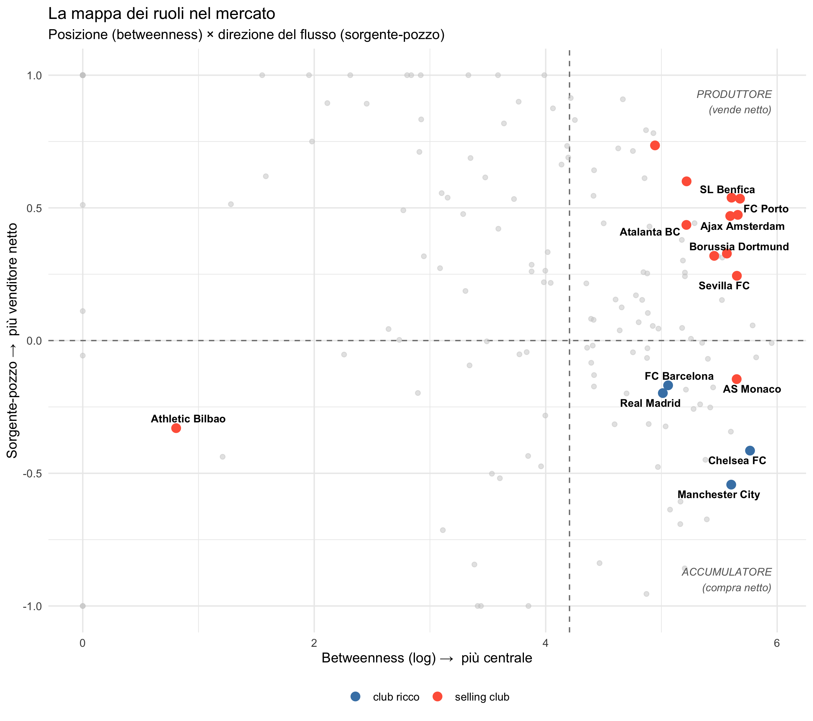

# Transfers Network Dynamics

Analisi della **rete dei trasferimenti calcistici** come sistema complesso.
Progetto per il corso *Data Driven Modeling of Complex Systems*.

## Domanda di ricerca

> La **posizione strutturale** di un club nella rete dei trasferimenti predice la sua capacità di
> **estrarre valore economico**, oltre e al di là della sua **spesa**?

È una *corsa di cavalli* tra due spiegazioni rivali dello stesso esito: un attributo individuale
del nodo (la spesa) contro una misura di rete (la centralità). La rete "si guadagna il posto"
solo se la posizione spiega ciò che la spesa da sola non spiega.

## Il risultato in una figura

Il mercato si organizza lungo due assi — **posizione** (betweenness) e **direzione del flusso**
(sorgente-pozzo) — che identificano ruoli strutturali distinti:

- **Broker-produttori** (alto-destra): centrali *e* venditori netti — Porto, Benfica, Ajax, Atalanta.
- **Accumulatori centrali** (basso-destra): comprano e assorbono talento — Real, Barça, City, Chelsea.
- **Produttore puro** (alto-sinistra): periferico ma venditore netto — Athletic Bilbao, un caso raro.

## I risultati in breve

- La **posizione predice l'estrazione di valore oltre la spesa**: nel modello con lag temporale
  (posizione in *t* → esito in *t+1*), la betweenness resta significativa, e il potere predittivo
  della spesa si dimezza quando la posizione entra nel modello.
- L'effetto è **concentrato sui grandi estrattori**: la posizione predice più la *magnitudine*
  dell'estrazione che il semplice fatto di estrarre (robusto su quattro specificazioni dell'esito).
- Esistono **due vie all'estrazione di valore**: l'*intermediazione* dei broker centrali e la
  *produzione diretta* dei club periferici (più efficienti: estraggono più valore per euro speso).
  La betweenness cattura la prima; la sua cecità alla seconda ne rivela l'esistenza.

## Dati

- **Fonte:** [d2ski/football-transfers-data](https://github.com/d2ski/football-transfers-data)
  — 7 leghe top europee, stagioni 2009–2021. I dati grezzi **non** sono inclusi: si scaricano dalla fonte.
- **Snapshot di riferimento:** luglio 2025 (il dataset a monte è fermo al 2021).

## Scelte metodologiche chiave

- **Esito Y** — margine sul valore di mercato: `(prezzo di vendita − valore di mercato)` sommato
  per club-stagione. Scelto perché il costo d'acquisto è censurato per ~2/3 del valore venduto
  (acquisti antecedenti alla finestra): usarlo fabbricherebbe profitto dal nulla.
- **Doppia frontiera della rete** — le grandezze di nodo (Y, spesa) si calcolano su tutte le
  transazioni dei club *core* (militanti nelle 7 leghe coperte); il grafo si costruisce solo sugli
  archi *core-to-core*, per non contaminare le misure di centralità.
- **Betweenness topologica** (non pesata sui valori) per evitare tautologia con l'esito economico.
- **Lag temporale** per rompere la causalità inversa; controlli per volume di transazioni;
  **errori standard clusterizzati** per club (osservazioni non indipendenti).
- **Caratterizzazione della rete:** sparsa, a coda pesante con hub (non power law pura — coda con
  cutoff), connessa in un'unica componente, distanze brevi, struttura nucleo-periferia.

## Struttura del repo

| File | Contenuto |
|---|---|
| `transfers_pre_processing.ipynb` | Preprocessing (Python): dai dati grezzi alle viste pulite. |
| `i-graph-transfers.R` | Analisi di rete (R/igraph): grafi stagionali, misure, modelli, grafici. |
| `node_season_core.csv` | Tabella nodo-stagione: esito Y + attributi individuali. |
| `edge_list_core.csv` | Edge list pesata e *season-aware* (archi core-to-core). |
| `club_names.csv` | Mappa `club_id → nome`. |
| `club_season_final.csv` | Tabella finale: attributi + misure di rete, per la corsa di cavalli. |
| `mappa_ruoli.png`, `rete_20XX.png` | Figure principali del progetto. |

## Pipeline

\`\`\`
dati grezzi (d2ski) → preprocessing Python → viste pulite (CSV) → analisi R/igraph → modelli + figure
\`\`\`
